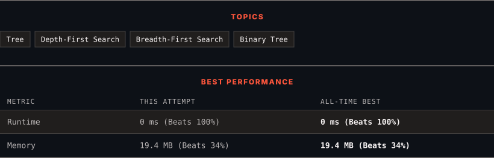

# 199. Binary Tree Right Side View

      

---

<picture>
  <source media="(prefers-color-scheme: dark)" srcset="panel-dark.svg">
  <source media="(prefers-color-scheme: light)" srcset="panel-light.svg">
  
</picture>

### HOW IT WENT

| | |
|:--|:--|
| **Attempts** | 2 before accepted |
| **Time to solve** | 1 min |
| **Verdicts** | ✅ Accepted → ✅ Accepted |

---

### NOTES

_No notes yet._

---

### SOLUTIONS (2)

| # | File | Language | Date |
|:-:|------|:--------:|:----:|
| 1 | [sol1.py](./sol1.py) | `Python` | 2026-09-21 |
| 2 | [sol2.py](./sol2.py) | `Python` | 2026-09-21 ← **latest** |

---

### PROBLEM DESCRIPTION

Given the `root` of a binary tree, imagine yourself standing on the **right side** of it, return *the values of the nodes you can see ordered from top to bottom*.

 

**Example 1:**

**Input:** root = [1,2,3,null,5,null,4]

**Output:** [1,3,4]

**Explanation:**

**Example 2:**

**Input:** root = [1,2,3,4,null,null,null,5]

**Output:** [1,3,4,5]

**Explanation:**

**Example 3:**

**Input:** root = [1,null,3]

**Output:** [1,3]

**Example 4:**

**Input:** root = []

**Output:** []

 

**Constraints:**

	- The number of nodes in the tree is in the range `[0, 100]`.

	- `-100 <= Node.val <= 100`

---

Auto-synced by <strong>LeetSync</strong> · Built by <a href="https://deveshsamant.in/">Devesh Samant</a>

