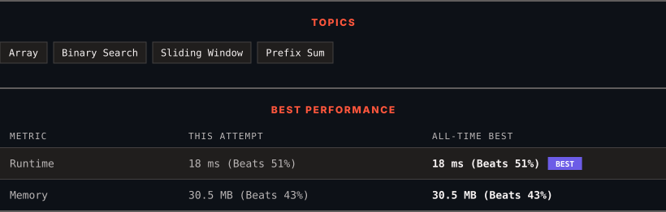

<div align="center">

# 209. Minimum Size Subarray Sum

      

[](https://leetcode.com/problems/minimum-size-subarray-sum/)

</div>

---

<div align="center">

<picture>
  <source media="(prefers-color-scheme: dark)" srcset="panel-dark.svg">
  <source media="(prefers-color-scheme: light)" srcset="panel-light.svg">
  
</picture>

</div>

### HOW IT WENT

| | |
|:--|:--|
| **Attempts** | 5 before accepted |
| **Time to solve** | 1 h 37 min |
| **Verdicts** | ❌ Wrong Answer → ❌ Wrong Answer → ❌ Wrong Answer → ✅ Accepted → ✅ Accepted |

---

### NOTES

_No notes yet._

---

### SOLUTIONS (2)

| # | File | Language | Date |
|:-:|------|:--------:|:----:|
| 1 | [sol1.py](./sol1.py) | `Python` | 2026-09-21 |
| 2 | [sol2.py](./sol2.py) | `Python` | 2026-09-21 ← **latest** |

---

### PROBLEM DESCRIPTION

Given an array of positive integers `nums` and a positive integer `target`, return *the **minimal length** of a **subarray** whose sum is greater than or equal to* `target`. If there is no such subarray, return `0` instead.

 

**Example 1:**

```

**Input:** target = 7, nums = [2,3,1,2,4,3]
**Output:** 2
**Explanation:** The subarray [4,3] has the minimal length under the problem constraint.

```

**Example 2:**

```

**Input:** target = 4, nums = [1,4,4]
**Output:** 1

```

**Example 3:**

```

**Input:** target = 11, nums = [1,1,1,1,1,1,1,1]
**Output:** 0

```

 

**Constraints:**

	- `1 <= target <= 10^9`

	- `1 <= nums.length <= 10^5`

	- `1 <= nums[i] <= 10^4`

 

**Follow up:** If you have figured out the `O(n)` solution, try coding another solution of which the time complexity is `O(n log(n))`.

---

<div align="center">

<sub>Auto-synced by <strong>LeetSync</strong> · Built by <a href="https://deveshsamant.in/">Devesh Samant</a></sub>

</div>
