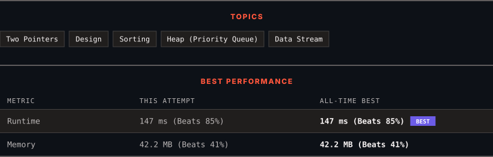

<div align="center">

# 295. Find Median from Data Stream

      

[](https://leetcode.com/problems/find-median-from-data-stream/)

</div>

---

<div align="center">

<picture>
  <source media="(prefers-color-scheme: dark)" srcset="panel-dark.svg">
  <source media="(prefers-color-scheme: light)" srcset="panel-light.svg">
  
</picture>

</div>

> **New personal best** — Runtime improved on this submission.

### HOW IT WENT

| | |
|:--|:--|
| **Attempts** | 4 before accepted |
| **Time to solve** | 23 min |
| **Verdicts** | ✅ Accepted → ❌ Wrong Answer → ❌ Wrong Answer → ✅ Accepted |

---

### NOTES

_No notes yet._

---

### SOLUTIONS (2)

| # | File | Language | Date |
|:-:|------|:--------:|:----:|
| 1 | [sol1.py](./sol1.py) | `Python` | 2026-09-21 |
| 2 | [sol2.py](./sol2.py) | `Python` | 2026-09-21 ← **latest** |

---

### PROBLEM DESCRIPTION

The **median** is the middle value in an ordered integer list. If the size of the list is even, there is no middle value, and the median is the mean of the two middle values.

	- For example, for `arr = [2,3,4]`, the median is `3`.

	- For example, for `arr = [2,3]`, the median is `(2 + 3) / 2 = 2.5`.

Implement the MedianFinder class:

	- `MedianFinder()` initializes the `MedianFinder` object.

	- `void addNum(int num)` adds the integer `num` from the data stream to the data structure.

	- `double findMedian()` returns the median of all elements so far. Answers within `10^-5` of the actual answer will be accepted.

 

**Example 1:**

```

**Input**
["MedianFinder", "addNum", "addNum", "findMedian", "addNum", "findMedian"]
[[], [1], [2], [], [3], []]
**Output**
[null, null, null, 1.5, null, 2.0]

**Explanation**
MedianFinder medianFinder = new MedianFinder();
medianFinder.addNum(1);    // arr = [1]
medianFinder.addNum(2);    // arr = [1, 2]
medianFinder.findMedian(); // return 1.5 (i.e., (1 + 2) / 2)
medianFinder.addNum(3);    // arr[1, 2, 3]
medianFinder.findMedian(); // return 2.0

```

 

**Constraints:**

	- `-10^5 <= num <= 10^5`

	- There will be at least one element in the data structure before calling `findMedian`.

	- At most `5 * 10^4` calls will be made to `addNum` and `findMedian`.

 

**Follow up:**

	- If all integer numbers from the stream are in the range `[0, 100]`, how would you optimize your solution?

	- If `99%` of all integer numbers from the stream are in the range `[0, 100]`, how would you optimize your solution?

---

<div align="center">

<sub>Auto-synced by <strong>LeetSync</strong> · Built by <a href="https://deveshsamant.in/">Devesh Samant</a></sub>

</div>
