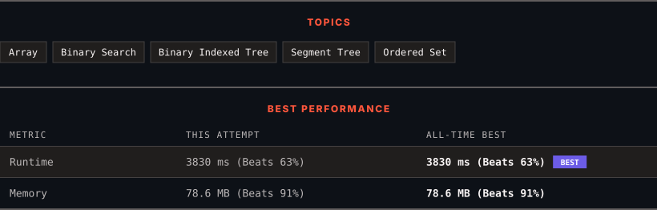

# 3161. Block Placement Queries

      

---

<picture>
  <source media="(prefers-color-scheme: dark)" srcset="panel-dark.svg">
  <source media="(prefers-color-scheme: light)" srcset="panel-light.svg">
  
</picture>

> **New personal best** — Runtime improved on this submission.

### HOW IT WENT

| | |
|:--|:--|
| **Attempts** | 6 before accepted |
| **Time to solve** | 21 min |
| **Verdicts** | ❌ Wrong Answer → ❌ Wrong Answer → ❌ Wrong Answer → ❌ Wrong Answer → ⏱ Time Limit Exceeded → ✅ Accepted |

---

### NOTES

_No notes yet._

---

### SOLUTIONS (1)

| # | File | Language | Date |
|:-:|------|:--------:|:----:|
| 1 | [sol1.py](./sol1.py) | `Python` | 2026-09-21 ← **latest** |

---

### PROBLEM DESCRIPTION

There exists an infinite number line, with its origin at 0 and extending towards the **positive** x-axis.

You are given a 2D array `queries`, which contains two types of queries:

	- For a query of type 1, `queries[i] = [1, x]`. Build an obstacle at distance `x` from the origin. It is guaranteed that there is **no** obstacle at distance `x` when the query is asked.

	- For a query of type 2, `queries[i] = [2, x, sz]`. Check if it is possible to place a block of size `sz` *anywhere* in the range `[0, x]` on the line, such that the block **entirely** lies in the range `[0, x]`. A block **cannot **be placed if it intersects with any obstacle, but it may touch it. Note that you do** not** actually place the block. Queries are separate.

Return a boolean array `results`, where `results[i]` is `true` if you can place the block specified in the `i^th` query of type 2, and `false` otherwise.

 

**Example 1:**

**Input:** queries = [[1,2],[2,3,3],[2,3,1],[2,2,2]]

**Output:** [false,true,true]

**Explanation:**

****

For query 0, place an obstacle at `x = 2`. A block of size at most 2 can be placed before `x = 3`.

**Example 2:**

**Input:** queries = [[1,7],[2,7,6],[1,2],[2,7,5],[2,7,6]]

**Output:** [true,true,false]

**Explanation:**

****

	- Place an obstacle at `x = 7` for query 0. A block of size at most 7 can be placed before `x = 7`.

	- Place an obstacle at `x = 2` for query 2. Now, a block of size at most 5 can be placed before `x = 7`, and a block of size at most 2 before `x = 2`.

 

**Constraints:**

	- `1 <= queries.length <= 15 * 10^4`

	- `2 <= queries[i].length <= 3`

	- `1 <= queries[i][0] <= 2`

	- `1 <= x, sz <= min(5 * 10^4, 3 * queries.length)`

	- The input is generated such that for queries of type 1, no obstacle exists at distance `x` when the query is asked.

	- The input is generated such that there is at least one query of type 2.

---

Auto-synced by <strong>LeetSync</strong> · Built by <a href="https://deveshsamant.in/">Devesh Samant</a>

